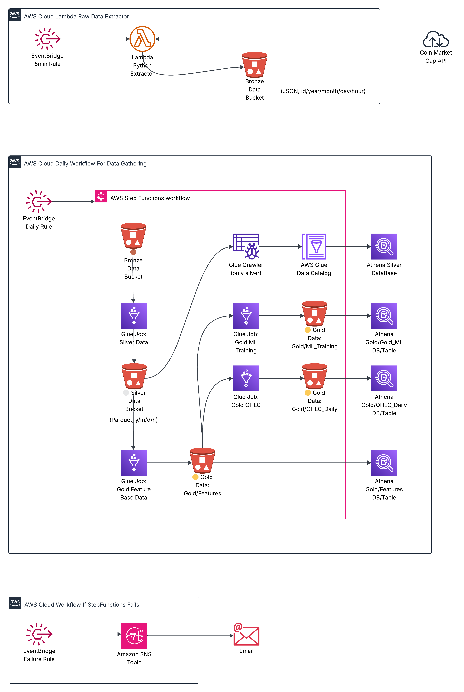
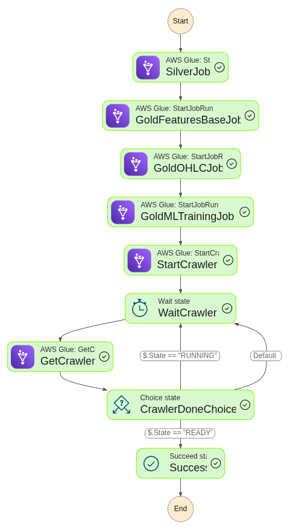

# 🚀 Near Real-Time Crypto Data Ingestion (AWS Medallion Architecture)

## 🧭 AWS Architecture Diagram

## StepFunctions Workflow: 

---

## 🧭 Project Overview

The **Near Real-Time Crypto Data Ingestion** project is a fully serverless **data lakehouse** built on AWS following the **Medallion Architecture (Bronze → Silver → Gold)**.

It ingests, processes, and prepares **top-10 cryptocurrency metrics** from the **CoinMarketCap API** every 5 minutes, producing **analytics- and ML-ready datasets**.

All infrastructure is defined as **Infrastructure-as-Code (Terraform)** and integrated with **AWS Glue, Athena, and Lake Formation** for complete data governance.

---

## ⚙️ Core AWS Components

- **Lambda (Bronze)** → API ingestion and normalization  
- **Glue Jobs (Silver / Gold)** → Transformation, enrichment, aggregation  
- **Glue Crawler + Athena** → Schema discovery & SQL access  
- **Step Functions + EventBridge** → Orchestrated daily pipelines  
- **Lake Formation** → Secure data catalog permissions  
- **S3 Buckets** → Medallion-layer storage (raw → curated → analytics)

---

## 🧱 Data Flow Summary

1. **Bronze Layer:** Raw JSON responses are ingested from the CoinMarketCap API into S3 (partitioned by asset and time).  
2. **Silver Layer:** Cleans & converts JSON to Parquet; schema is registered in Glue for Athena queries.  
3. **Gold Layer:** Builds three logical datasets:  
   - **Features Base** (validated metrics)  
   - **OHLC** (Open-High-Low-Close series)  
   - **ML Training** (engineered features for ML models)  
4. **Step Functions:** Orchestrates Glue Jobs sequentially (Silver → Gold) and refreshes Athena catalogs automatically.  
5. **Athena / QuickSight / SageMaker:** Consume curated data for analytics & machine learning.

---

## 🧩 Documentation Index

| # | Section | Description |
|---|----------|-------------|
| 1️⃣ | 🥉 [Bronze Layer — Raw Ingestion](./milestone_bronze.md) | Lambda-based API extraction, normalization & raw S3 storage |
| 2️⃣ | 🥈 [Silver Layer — Transformation](./milestone_silver.md) | Cleansed Parquet data with schema tracking and traceability |
| 3️⃣ | 🥇 [Gold Layer — Analytics & ML](./milestone_gold.md) | Feature engineering, OHLC aggregations & ML dataset generation |
| 4️⃣ | 🧩 [Partitioning Strategy](./bronze_silver_gold_partitions.md) | Rationale for different partition grains per layer |
| 5️⃣ | ✅ [Lake Formation Checklist](./Lake_Formation_Checklist.md) | Step-by-step setup for catalog permissions and data access |
| 6️⃣ | 🧱 [Challenges Overcome](./challenges_overcome.md) | Technical problems solved throughout the project |

---

## 🧠 Key Outcomes

- Near-real-time crypto data pipeline (5 min cadence).  
- End-to-end serverless architecture (AWS native).  
- Full IaC deployment via Terraform.  
- Partition-projection-based Athena queries (no crawlers).  
- ML-ready datasets for future forecasting models.

---

## 🧭 Next Steps

- Build QuickSight dashboards for price & volatility analysis.  
- Develop ML prototype for price forecasting or trend classification.

---

📊 *Data provided by [CoinMarketCap.com](https://coinmarketcap.com).  
Used solely for internal R&D and educational purposes.*
