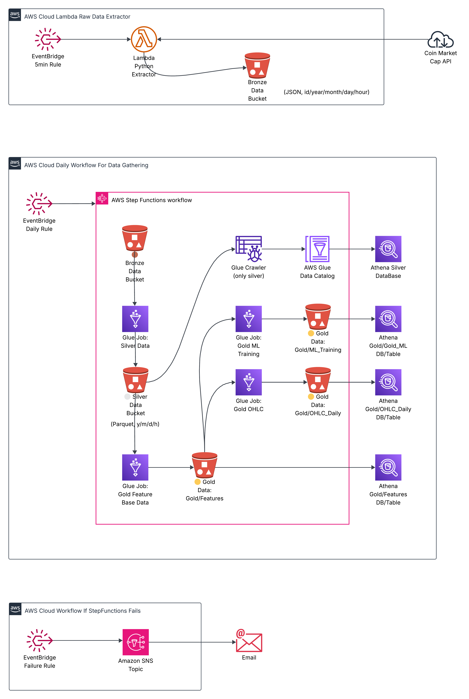
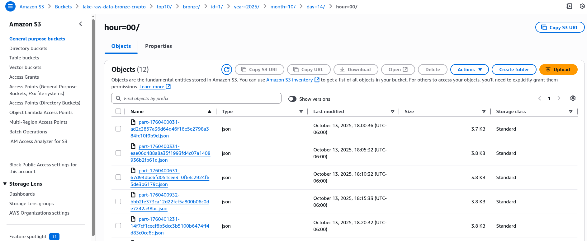
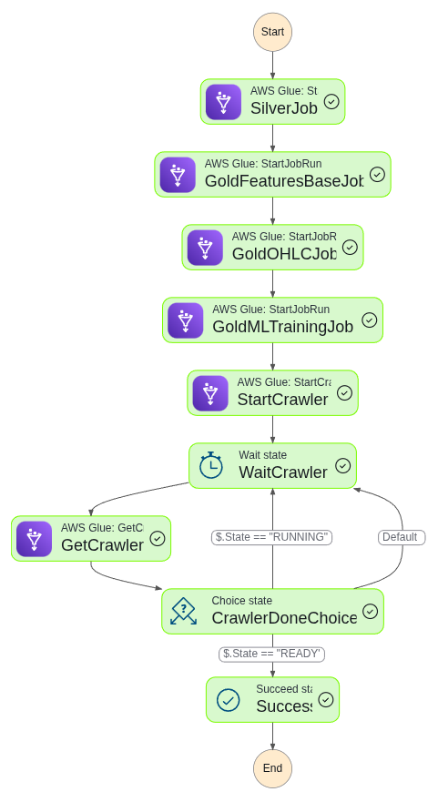

# 🚀 Near Real-Time Crypto Data Ingestion (AWS Medallion Architecture)

## 🧭 AWS Architecture Diagram

## S3 Bucket For Data In JSON
How the data and partitions looks like: 

## StepFunctions Workflow: 

---

## 🧭 Project Overview

The **Near Real-Time Crypto Data Ingestion** project is a fully serverless **data lakehouse** built on AWS following the **Medallion Architecture (Bronze → Silver → Gold)**.

It ingests, processes, and prepares cryptocurrency market data into **analytics- and ML-ready datasets**.

All infrastructure is defined as **Infrastructure-as-Code (Terraform)** and integrated with **AWS Glue, Athena, and Lake Formation** for complete data governance.

> ⏸️ **The pipeline is currently dormant on purpose** while it is being
> restructured. See [`roadmap.md`](./roadmap.md) for the phase plan and the two
> conditions that wake it back up.

---

## 🔀 Data sources — a hybrid, two-source ingestion

The pipeline used to poll the CoinMarketCap REST API every 5 minutes. **Phase 4
replaced that with two sources that do different jobs**, because putting a queue in
front of a poller does not make a pipeline streaming:

| Source | Role | Cadence |
|---|---|---|
| **Binance WebSocket** (public, no auth) | The streaming feed: price and volume at tick granularity | continuous |
| **CoinMarketCap REST** | Market context no exchange can provide — cross-exchange aggregate price, market cap, circulating supply, dominance, rank | hourly |

**Why keep CoinMarketCap at all.** Market cap, supply and dominance are properties
of an *asset*, not of a *trading pair* — an exchange only knows what trades on it.
It also gives cross-validation against a single venue's price, coverage of the five
tracked assets that have no Binance pair, and a feed that keeps writing if the
WebSocket drops.

**The tracked universe is fixed at 50 hand-picked assets**, committed as code in
[`config/tracked_assets.json`](./config/tracked_assets.json) — deliberately *not* a
live top-50 ranking, which would silently change the tracked set and make the
training data non-reproducible. They are selected for **diversity of behaviour**
rather than market-cap rank, including stablecoins as a negative control (a model
that emits signals on a series pinned at 1.0000 is broken) and gold-pegged tokens
as a non-crypto risk factor.

**The join is as-of, backward, on the CoinMarketCap id** — never on the ticker
symbol, which case-shifts (`XAUt` vs `XAUT`), gets renamed (`RNDR` → `RENDER`) and
gets re-issued under a new id (`MATIC` → `POL`).

**History comes from the same place, for free.** Binance publishes its complete
1-minute kline archive at `data.binance.vision` — ~133 million candles back to
2017, ~4.4 GB, no API key. The archived file and the live `@kline_1m` event carry
the same twelve fields from the same exchange, so the backfill and the stream
concatenate into one continuous series rather than being glued approximately. That
is what makes model training possible without waiting years for the pipeline to
accumulate data.

Full decision record, the per-asset rationale, the credit budget, the backfill and
the join design: **[`data_sources.md`](./data_sources.md)**.

---

## ⚙️ Core AWS Components

- **Lambda (Bronze)** → API ingestion and normalization  
- **Glue Jobs (Silver / Gold)** → Transformation, enrichment, aggregation  
- **Glue Crawler + Athena** → Schema discovery & SQL access  
- **Step Functions + EventBridge** → Orchestrated daily pipelines  
- **Lake Formation** → Secure data catalog permissions  
- **S3 Buckets** → Medallion-layer storage (raw → curated → analytics)

---

## 🧱 Data Flow Summary

1. **Bronze Layer:** Raw payloads land in S3 under a source-based prefix (`cmc/`, and `binance/` once Phase 5 ships the streaming producer).  
2. **Silver Layer:** Cleans & converts JSON to Parquet; schema is registered in Glue for Athena queries.  
3. **Gold Layer:** Builds three logical datasets:  
   - **Features Base** (validated metrics)  
   - **OHLC** (Open-High-Low-Close series)  
   - **ML Training** (engineered features for ML models)  
4. **Step Functions:** Orchestrates Glue Jobs sequentially (Silver → Gold) and refreshes Athena catalogs automatically.  
5. **Athena / QuickSight / SageMaker:** Consume curated data for analytics & machine learning.

---

## 🧩 Documentation Index

| # | Section | Description |
|---|----------|-------------|
| 1️⃣ | 🥉 [Bronze Layer — Raw Ingestion](./milestone_bronze.md) | Lambda-based API extraction, normalization & raw S3 storage |
| 2️⃣ | 🥈 [Silver Layer — Transformation](./milestone_silver.md) | Cleansed Parquet data with schema tracking and traceability |
| 3️⃣ | 🥇 [Gold Layer — Analytics & ML](./milestone_gold.md) | Feature engineering, OHLC aggregations & ML dataset generation |
| 4️⃣ | 🧩 [Partitioning Strategy](./bronze_silver_gold_partitions.md) | Rationale for different partition grains per layer |
| 5️⃣ | ✅ [Lake Formation Checklist](./Lake_Formation_Checklist.md) | Step-by-step setup for catalog permissions and data access |
| 6️⃣ | 🧱 [Challenges Overcome](./challenges_overcome.md) | Technical problems solved throughout the project |
| 7️⃣ | 🔀 [Data Source Strategy](./data_sources.md) | Why Binance WebSocket **and** CoinMarketCap, the frozen 50-asset list, and the join |
| 8️⃣ | 🗺️ [Roadmap](./roadmap.md) | Phase-by-phase plan from batch pipeline to a full ML/MLOps system |

---

## 🧠 Key Outcomes

- Hybrid streaming + batch ingestion (Binance WebSocket + CoinMarketCap hourly).  
- End-to-end serverless architecture (AWS native).  
- Full IaC deployment via Terraform.  
- Partition-projection-based Athena queries (no crawlers).  
- ML-ready datasets for future forecasting models.

---

## 🧭 Next Steps

Tracked phase by phase in [`roadmap.md`](./roadmap.md). Immediately next:

- **Phase 5 — Streaming ingestion:** Kinesis + Firehose + the Binance WebSocket
  producer. This is the phase where the project wakes up.
- **Phase 6 onward:** feature engineering, model training, registry, serving, and
  the model feedback loop that is the actual goal of the project.

---

📊 *Market context data provided by [CoinMarketCap.com](https://coinmarketcap.com);
market data from Binance public endpoints.  
Used solely for internal R&D and educational purposes.*
